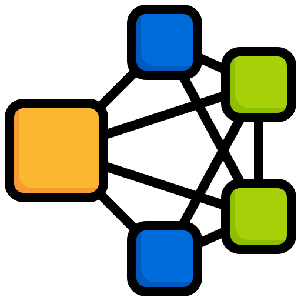

# Picture Aggregator

A powerful Flask-based web application that automatically detects and groups faces from your photo collection. Perfect for organizing large photo libraries, event photos, or family albums by detecting and aggregating similar faces together.

## 🌟 Features

- Upload multiple images through web interface
- Process entire folders of images
- Automatic face detection and grouping
- Maintains face recognition across multiple uploads
- Rename face groups for better organization
- View grouped photos through web interface
- Preserves original images while organizing them by faces
- Smart face detection with central region priority
- Handles both single files and directories

## 🚀 Getting Started

### Demo

<p align="center">
  
</p>

If the demo gif isn't visible above or is too fast, you can [view the demo video here](./static/demo.mp4).

Watch the demo above to see how to use the application. The video demonstrates:
- Uploading multiple images
- Processing folders
- Viewing grouped results
- Managing face groups

### Prerequisites

- Python 3.9 or higher
- Docker (optional)


## 📁 Project Structure

The project follows a simple and organized structure:

    picture-aggregator/
    ├── app.py              # Main Flask application
    ├── face_grouper.py     # Core face detection and grouping logic
    ├── templates/          # HTML templates
    │   └── index.html     # Main web interface
    ├── static/            # Static files (CSS, images)
    ├── uploads/           # Temporary upload directory
    └── output/            # Grouped faces output directory


### Installation

1. Clone the repository:
```bash
git clone https://github.com/anandsummer28/Picture-Aggregator.git
cd picture-aggregator
```

2. Install required dependencies:
```bash
pip install -r requirements.txt
```

### Running the Application

#### Using Python directly:
```bash
python app.py
```
The application will be available at `http://localhost:5000`

#### Using Docker:
```bash
docker build -t face-grouping-app .
docker run -p 5000:5000 face-grouping-app
```

## 📖 Usage

### Web Interface

1. **Upload Images**
   - Click "Choose Files" to select multiple images
   - Click "Upload" to process the selected images
   - The application will automatically detect and group faces

2. **Process Folder**
   - Enter the full path to a folder containing images
   - Click "Process" to analyze all images in the folder
   - Supported formats: .jpg, .jpeg, .png

3. **View Results**
   - Click "View Output" to see the grouped faces
   - Each face group has its own folder
   - You can rename face groups for better organization

4. **Reset**
   - Use the "Reset" button to clear current uploads
   - Previous outputs are preserved with timestamps

## 🔧 How It Works

1. **Face Detection**: Uses the `face_recognition` library with HOG model for efficient face detection
2. **Smart Grouping**: 
   - Prioritizes faces in the central region of images
   - Uses face encoding comparison to group similar faces
   - Maintains consistency across multiple upload sessions
3. **Organization**:
   - Creates separate folders for each unique face
   - Saves both the full image and a cropped face sample
   - Preserves original image names and quality

## 🤝 Contributing

Contributions are welcome! Please feel free to submit a Pull Request.

## 📄 License

This project is licensed under the MIT License - see the [LICENSE](LICENSE) file for details.

## ⚠️ Notes

- For optimal face detection, ensure images are well-lit and faces are clearly visible
- Processing time may vary based on image size and number of faces
- The application maintains face recognition data during the session
- Original images are preserved in face group folders

## 🐛 Troubleshooting

- If face detection seems inaccurate, try with better-lit images
- For large folders, allow sufficient processing time
- Ensure sufficient disk space for output folders
- Check file permissions if processing folders fails
